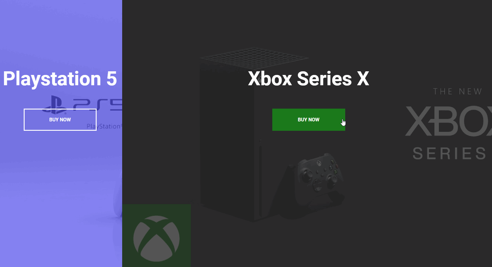

# Split Landing Page

## 🦉 Main information

Split landing page built with Html5, CSS3 and Vanilla Js.

The project goal:
- create split screen with a background image and a button inside
- when user clicks on one side, it's going to stretch out to about 75% and for the other side 25%
- use CSS for styling and make smoothly transition 
- use JavaScript for the hover effects
- set up in HTML, style it with CSS and add the functionality with JavaScript

## ⚡ Built With
[HTML5](https://www.w3schools.com/html/) / [CSS3](https://www.w3schools.com/css/) / [JavaScript](https://www.w3schools.com/js/)